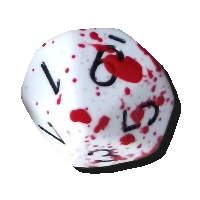
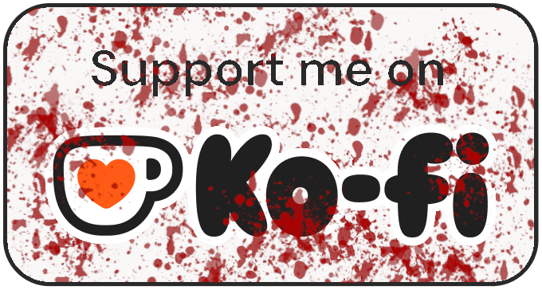

# Sanguihedral

Sanguihedral is intended to be a cross-platform, sect-agnostic dice roller and character sheet app for Vampire the Masquerade v5. This app is designed and built for two purposes:

- Firstly, it is intended to be my final project for my studies as a TripleTen Full-Stack Software Engineer student

- Second, it was requested by my local LARP group because our preferred dice rolling app is no longer available for iOS users and we needed a replacement

Current version can be found here => <https://uncletallest.github.io/sanguihedral/>

## Design Notes

To be "complete" this app needs to give the player the ability to =>

Character Sheet options:

- choose Sect [this changes the dice image used for rolls and sheet labels]

- choose Clan [this also affects images and sheet labels]

- input character values [this populates available rolls]

Dice Roller options:

- choose what to roll [ensure there is a custom option (maybe a picker?) for when the ST allows an alternate skill for a given roll] -- include rouse checks, frenzy checks, and hunting rolls in this

- account for hunger when rolling

- display successes, critical successes, and failures

Nice to haves =>

- adjustable advantage/disadvantage on rolls

- display messy criticals and bestial failures

## Final note

Want to show me appreciation for the work I've done on this free app?

Well then, buy me a coffee...

